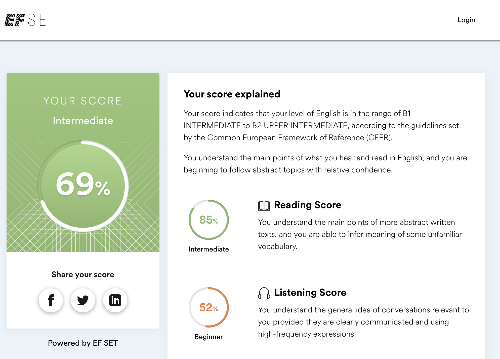

# Vladislav Ga

## Contacts

- telegram: @vladislavGa
- Email: marker661@gmail.com
- GitHub: Glitch-surfer
- Discord: Vladislav (@glitch-surfer)

## About Me

I admire the ability of living organisms to adapt and evolve. As soon as I realized that I had realized myself as a specialist, and in my professional sphere the pace of my development began to slow down, and new, unexplored aspects became less and less, I began to look in which direction to move on. It was a simple choice because: 
- such an interesting, versatile and creative field
- with an open community 
- free access for all
- reasonable training time 

In my opinion, the IT sphere corresponds perfectly. That's why I'm here!

My strengths:
*learning ability
*persistence
*empathy

## Skills

- HTML (Semantic, Accessibility)
- CSS (BEM, Responsive Web Design, CSS Flexbox, Bootstrap grid, etc)
- JavaScript (Basic)
- Git/GitHub

## Code Example

### reverse string

``` 
let example = 'Привет, мир!'
let exampleReverse = ''
for (i=0; i< example.length; ++i) {
    exampleReverse = `${example[i]}${exampleReverse}`
}
console.log(exampleReverse)
```
## Experience

selfeducation, while i`am training HTML, CSS, basic JS, layout, figma, photoshop, chrome DevTools, VScode, GitHub, Terminal

- [https://github.com/glitch-surfer/super-enigma](https://github.com/glitch-surfer/super-enigma)
- [https://github.com/glitch-surfer/pet2](https://github.com/glitch-surfer/pet2)
- [https://github.com/glitch-surfer/pet2.1-customize-UI](https://github.com/glitch-surfer/pet2.1-customize-UI)

## Education

* Northwestern State Medical University / Faculty of Medicine
* selfeducation with: 
    * [Hexlet](https://ru.hexlet.io/webinars)
    * [HTML Academy](https://htmlacademy.ru)
    * [Youtube](youtube.ru)
* RS Schools Course «JavaScript/Front-end 2023Q1 Stage 1» in progress

## Language

- Russian - Native
- English - Intermediate (according to the online test at EFset Logo [www.efset.org](www.efset.org))
